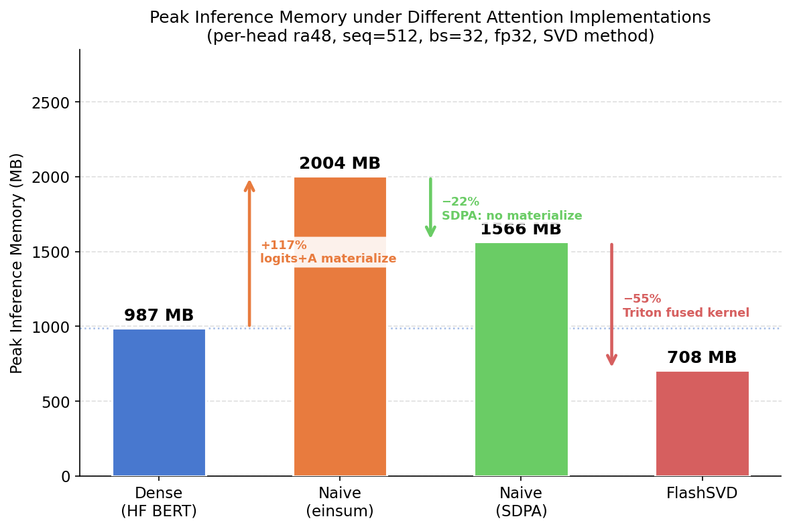
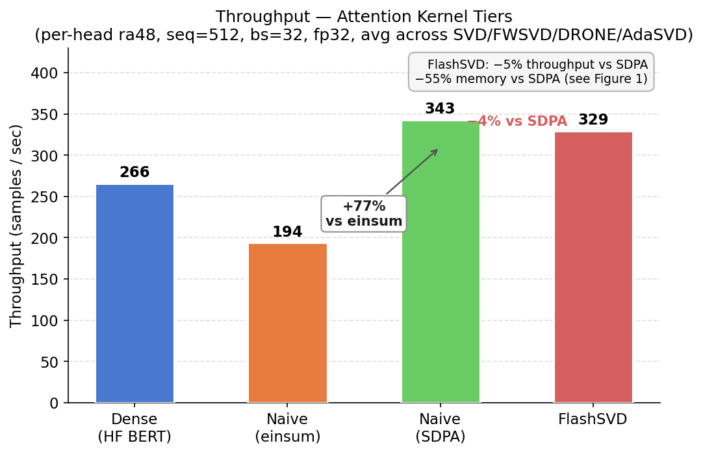
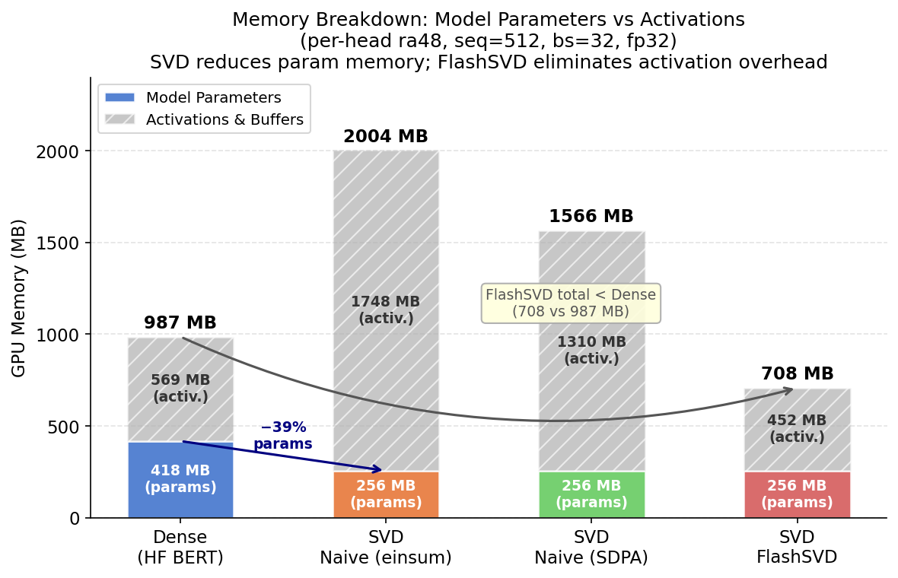
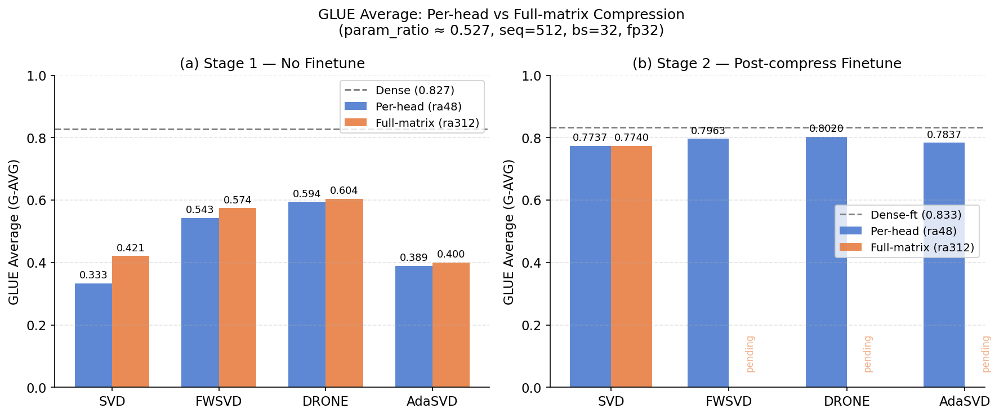
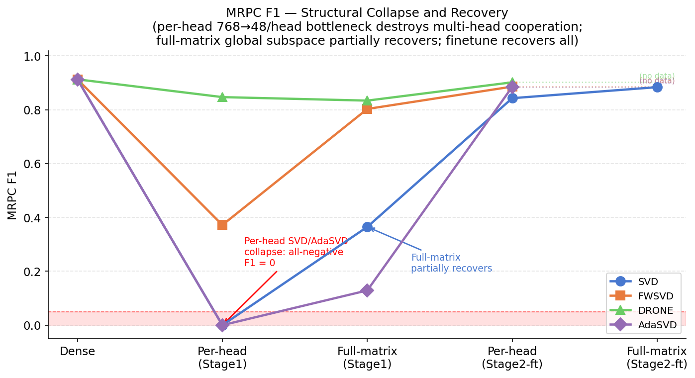
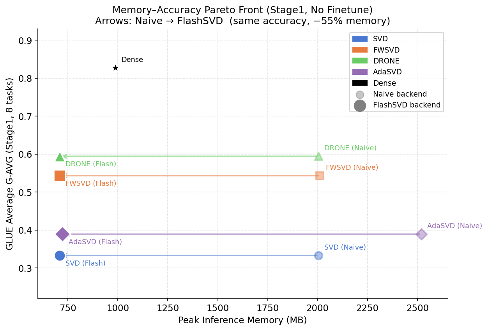

### **Dense baseline（naive，seq=512，bs=32，fp32）**
| Task | Metric | Dense score | Latency (ms) | Throughput (samples/s) | Peak mem infer (MB) |
|---|---:|---:|---:|---:|---:|
| CoLA | MCC | 0.533877 | 120.34 | 262.6 | 987.2 |
| SST-2 | Acc | 0.924312 | 110.74 | 281.2 | 987.2 |
| MRPC | F1 | 0.913495 | 112.40 | 279.2 | 987.2 |
| QQP | F1 | 0.878181 | 127.00 | 251.9 | 987.2 |
| MNLI-m | Acc | 0.845848 | 125.74 | 254.3 | 987.2 |
| QNLI | Acc | 0.915431 | 125.51 | 254.5 | 987.2 |
| RTE | Acc | 0.725632 | 111.82 | 275.2 | 987.2 |
| STS-B | Pearson | 0.880462 | 119.64 | 266.7 | 987.2 |
| **G-AVG** | — | **0.8272** | 119.1 | 265.7 | 987.2 |
| **A-AVG** | Acc(4) | **0.8528** | — | — | — |

> **注：为何 Dense 987 MB 而压缩 Naive 约 2004 MB？**
> HF BERT 在 PyTorch ≥ 2.0 下默认走 SDPA 融合路径，**不物化** `[B,H,M,M]` logits 与 attention weights；
> 压缩 Naive(einsum) backend 显式计算这两个矩阵（各 ≈ 384 MB，合计 ≈ 768 MB 额外开销）。
> 这是 **kernel 实现差异，非对比不公平**。FlashSVD（~708 MB）才是与 Dense 同水位的公平对比。
> 详见 Issues_found.md #19。

### 压缩未微调（naive backend，per-head ra48）——精度对比 + Δ vs Dense
| Task | Dense | SVD | Δ | FWSVD | Δ | DRONE | Δ | AdaSVD | Δ |
|---|---:|---:|---:|---:|---:|---:|---:|---:|---:|
| CoLA (MCC) | 0.533877 | 0.026364 | -0.5075 | 0.144358 | -0.3895 | 0.015667 | -0.5182 | 0.002035 | -0.5318 |
| SST-2 (Acc) | 0.924312 | 0.717890 | -0.2064 | 0.777523 | -0.1468 | 0.855505 | -0.0688 | 0.613532 | -0.3108 |
| MRPC (F1) | 0.913495 | 0.000000 | -0.9135 | 0.371968 | -0.5415 | 0.847244 | -0.0663 | 0.000000 | -0.9135 |
| QQP (F1) | 0.878181 | 0.171670 | -0.7065 | 0.680015 | -0.1982 | 0.762204 | -0.1160 | 0.515351 | -0.3628 |
| MNLI-m (Acc) | 0.845848 | 0.373510 | -0.4723 | 0.522262 | -0.3236 | 0.578706 | -0.2671 | 0.348650 | -0.4972 |
| QNLI (Acc) | 0.915431 | 0.546403 | -0.3690 | 0.573311 | -0.3421 | 0.602050 | -0.3134 | 0.458356 | -0.4571 |
| RTE (Acc) | 0.725632 | 0.472924 | -0.2527 | 0.584838 | -0.1408 | 0.595668 | -0.1300 | 0.534296 | -0.1913 |
| STS-B (Pearson) | 0.880462 | 0.352223 | -0.5282 | 0.693440 | -0.1870 | 0.492980 | -0.3875 | 0.636666 | -0.2438 |
| **G-AVG** | **0.8272** | **0.3326** | -0.4945 | **0.5435** | -0.2837 | **0.5938** | -0.2334 | **0.3886** | -0.4385 |
| **A-AVG** | **0.8528** | **0.5277** | -0.3251 | **0.6145** | -0.2383 | **0.6580** | -0.1948 | **0.4887** | -0.3641 |

### 压缩后微调（post-compress finetune，per-head ra48）——精度对比 + Δ vs 对照基线
| Task | Base (Dense or Dense_finetuned) | SVD-ft | Δ | FWSVD-ft | Δ | DRONE-ft | Δ | AdaSVD-ft | Δ |
|---|---:|---:|---:|---:|---:|---:|---:|---:|---:|
| CoLA (MCC) | 0.578332 | 0.374585 | -0.2037 | 0.471691 | -0.1066 | 0.431304 | -0.1470 | 0.410800 | -0.1675 |
| SST-2 (Acc) | 0.925459 | 0.910550 | -0.0149 | 0.904817 | -0.0206 | 0.908257 | -0.0172 | 0.916284 | -0.0092 |
| MRPC (F1) | 0.913495 | 0.843333 | -0.0702 | 0.885522 | -0.0280 | 0.901893 | -0.0116 | 0.884746 | -0.0287 |
| QQP (F1) | 0.878181 | 0.872762 | -0.0054 | 0.873900 | -0.0043 | 0.872570 | -0.0056 | 0.874060 | -0.0041 |
| MNLI-m (Acc) | 0.845848 | 0.820071 | -0.0258 | 0.827305 | -0.0185 | 0.820071 | -0.0258 | 0.823332 | -0.0225 |
| QNLI (Acc) | 0.915431 | 0.889072 | -0.0264 | 0.891085 | -0.0243 | 0.893282 | -0.0221 | 0.891818 | -0.0236 |
| RTE (Acc) | 0.725632 | 0.613718 | -0.1119 | 0.646209 | -0.0794 | 0.740072 | +0.0144 | 0.595668 | -0.1300 |
| STS-B (Pearson) | 0.880462 | 0.865878 | -0.0146 | 0.869957 | -0.0105 | 0.848666 | -0.0318 | 0.872942 | -0.0075 |
| **G-AVG** | **0.8329** | **0.7737** | -0.0591 | **0.7963** | -0.0365 | **0.8020** | -0.0308 | **0.7837** | -0.0491 |
| **A-AVG** | **0.8531** | **0.8084** | -0.0448 | **0.8174** | -0.0357 | **0.8404** | -0.0127 | **0.8068** | -0.0463 |

### System Performance（per-head ra48，seq=512，bs=32，fp32）
格式：Naive = lat(ms)/thr(sps)/mem(MB)，Flash = 同格式

| Task | Method | Naive | Flash | Speedup | Memory Change |
|------|--------|------------------|------------------|----------|---------------------------|
| CoLA | SVD | 161/196/2004 | 92/348/708 | x1.75 | -1296 MB (-64.7%) |
| CoLA | FWSVD | 158/200/2011 | 95/338/708 | x1.67 | -1303 MB (-64.8%) |
| CoLA | DRONE | 163/194/2004 | 94/339/708 | x1.73 | -1296 MB (-64.7%) |
| CoLA | AdaSVD | 166/190/2522 | 101/317/725 | x1.65 | -1797 MB (-71.3%) |
| SST-2 | SVD | 160/195/2004 | 91/352/708 | x1.75 | -1296 MB (-64.7%) |
| SST-2 | FWSVD | 157/198/2011 | 93/345/708 | x1.69 | -1303 MB (-64.8%) |
| SST-2 | DRONE | 161/194/2004 | 93/345/708 | x1.73 | -1296 MB (-64.7%) |
| SST-2 | AdaSVD | 164/190/2516 | 99/322/722 | x1.65 | -1794 MB (-71.3%) |
| MRPC | SVD | 161/194/2004 | 94/342/708 | x1.72 | -1296 MB (-64.7%) |
| MRPC | FWSVD | 158/199/2011 | 93/344/708 | x1.70 | -1303 MB (-64.8%) |
| MRPC | DRONE | 162/193/2004 | 94/342/708 | x1.73 | -1296 MB (-64.7%) |
| MRPC | AdaSVD | 166/189/2523 | 100/319/725 | x1.66 | -1797 MB (-71.3%) |
| QQP | SVD | 166/192/2004 | 100/319/708 | x1.66 | -1296 MB (-64.7%) |
| QQP | FWSVD | 162/197/2011 | 101/316/708 | x1.60 | -1303 MB (-64.8%) |
| QQP | DRONE | 167/192/2004 | 102/314/708 | x1.64 | -1296 MB (-64.7%) |
| QQP | AdaSVD | 169/189/2519 | 107/299/723 | x1.58 | -1796 MB (-71.3%) |
| MNLI-m | SVD | 166/193/2004 | 100/320/708 | x1.66 | -1296 MB (-64.7%) |
| MNLI-m | FWSVD | 162/198/2011 | 100/321/708 | x1.62 | -1303 MB (-64.8%) |
| MNLI-m | DRONE | 166/193/2004 | 100/320/708 | x1.66 | -1296 MB (-64.7%) |
| MNLI-m | AdaSVD | 168/190/2516 | 102/313/724 | x1.64 | -1792 MB (-71.3%) |
| QNLI | SVD | 166/193/2004 | 99/323/708 | x1.67 | -1296 MB (-64.7%) |
| QNLI | FWSVD | 161/198/2011 | 99/325/708 | x1.64 | -1303 MB (-64.8%) |
| QNLI | DRONE | 166/193/2004 | 99/325/708 | x1.68 | -1296 MB (-64.7%) |
| QNLI | AdaSVD | 168/190/2515 | 101/315/721 | x1.66 | -1794 MB (-71.3%) |
| RTE | SVD | 161/191/2004 | 93/346/708 | x1.74 | -1296 MB (-64.7%) |
| RTE | FWSVD | 156/197/2011 | 93/345/708 | x1.68 | -1303 MB (-64.8%) |
| RTE | DRONE | 160/192/2004 | 93/346/708 | x1.73 | -1296 MB (-64.7%) |
| RTE | AdaSVD | 164/188/2515 | 98/326/721 | x1.67 | -1794 MB (-71.3%) |
| STS-B | SVD | 165/194/2004 | 96/335/708 | x1.72 | -1296 MB (-64.7%) |
| STS-B | FWSVD | 160/199/2011 | 96/335/708 | x1.67 | -1303 MB (-64.8%) |
| STS-B | DRONE | 165/194/2004 | 96/335/708 | x1.72 | -1296 MB (-64.7%) |
| STS-B | AdaSVD | 168/190/2524 | 103/311/726 | x1.63 | -1799 MB (-71.3%) |

### SDPA 消融（三档对比）：Naive(einsum) → Naive(SDPA) → FlashSVD(Triton)

**SDPA**（Scaled Dot-Product Attention）是 PyTorch 2.0 引入的融合 attention 算子（`torch.nn.functional.scaled_dot_product_attention`）。它通过 Flash Attention 算法分块计算 softmax(QKᵀ/√d)V，**不显式物化** [B,H,M,M] 的 logits 和 attention weight 矩阵，从而大幅降低显存占用并提升吞吐。HF BERT 在 PyTorch ≥ 2.0 下默认走此路径；压缩模型的 Naive(einsum) 实现则使用显式 einsum，会完整物化上述两个矩阵（各约 384 MB，seq=512, bs=32, fp32）。

测试条件：per-head ra48，seq=512，bs=32，fp32，8 tasks 平均（跳过精度评估，仅测吞吐/内存）

| Method | Naive-einsum (ms/sps/MB) | Naive-SDPA (ms/sps/MB) | FlashSVD (ms/sps/MB) | einsum→SDPA | SDPA→Flash | Flash vs einsum mem | Flash vs SDPA mem |
|--------|--------------------------|------------------------|----------------------|-------------|------------|---------------------|-------------------|
| SVD | 163/194/2004 | 91/349/1566 | 96/336/708 | x1.79 | x0.95 | -64.7% | -54.8% |
| FWSVD | 159/198/2011 | 91/346/1566 | 96/333/708 | x1.75 | x0.95 | -64.8% | -54.8% |
| DRONE | 164/193/2004 | 92/344/1566 | 96/333/708 | x1.78 | x0.96 | -64.7% | -54.8% |
| AdaSVD | 167/190/2519 | 95/332/1588 | 102/315/723 | x1.76 | x0.93 | -71.3% | -54.5% |

**关键结论：**
- Flash attention（einsum→SDPA）贡献约 **+77% 吞吐**，内存 -22%（2004→1566 MB）
- Triton 投影融合（SDPA→FlashSVD）贡献额外 **-55% 内存**（1566→708 MB），但吞吐略降 ~5%
- FlashSVD 相对 Naive(einsum) 综合效果：**+73% 吞吐，-64.7% 内存**
- SDPA 吞吐（~346 sps）略高于 FlashSVD（~332 sps）：Triton kernel 融合节省内存但引入少量计算开销

**Figure 1:** Peak inference memory under different attention implementations (per-head ra48, seq=512, bs=32, fp32). Naive (einsum) materializes the [B,H,M,M] attention matrices, resulting in 2004 MB peak memory. PyTorch SDPA avoids explicit materialization (1566 MB). FlashSVD further fuses low-rank projections with attention, reducing memory to 708 MB (−65% vs einsum, −55% vs SDPA), below the dense baseline (987 MB).

**Figure 2:** Throughput across attention kernel tiers (averaged over SVD/FWSVD/DRONE/AdaSVD, per-head ra48). SDPA improves throughput by ~77% over einsum. FlashSVD achieves similar throughput (−5%) while substantially reducing memory (Figure 1).

**Figure 3:** Parameter vs activation memory breakdown (per-head ra48, seq=512, bs=32, fp32). SVD reduces parameter memory (418→256 MB, −39%). Einsum-based attention inflates activation memory due to explicit attention matrix materialization. SDPA and FlashSVD progressively reduce activation footprint. *Activation memory is estimated as peak memory minus parameter footprint (total parameters × 4 bytes). Peak memory is measured via `torch.cuda.max_memory_allocated()` during inference; optimizer states are absent and minor allocator overhead may introduce small deviation.*

### Full-matrix ra312 vs Per-head ra48（stage1，无微调）精度对比
两种配置参数量相同（param_ratio≈0.5275，total≈0.6334）

| Task | Dense | SVD-PH | SVD-FM | FWSVD-PH | FWSVD-FM | DRONE-PH | DRONE-FM | AdaSVD-PH | AdaSVD-FM |
|------|------:|-------:|-------:|---------:|---------:|---------:|---------:|----------:|----------:|
| CoLA (MCC) | 0.534 | 0.026 | -0.018 | 0.144 | 0.188 | 0.016 | 0.078 | 0.002 | -0.004 |
| SST-2 (Acc) | 0.924 | 0.718 | 0.783 | 0.778 | 0.825 | 0.856 | 0.847 | 0.614 | 0.620 |
| MRPC (F1) | 0.913 | 0.000 | 0.365 | 0.372 | 0.803 | 0.847 | 0.834 | 0.000 | 0.129 |
| QQP (F1) | 0.878 | 0.172 | 0.590 | 0.680 | 0.586 | 0.762 | 0.714 | 0.515 | 0.558 |
| MNLI-m (Acc) | 0.846 | 0.374 | 0.366 | 0.522 | 0.493 | 0.579 | 0.596 | 0.349 | 0.330 |
| QNLI (Acc) | 0.915 | 0.546 | 0.387 | 0.573 | 0.517 | 0.602 | 0.566 | 0.458 | 0.461 |
| RTE (Acc) | 0.726 | 0.473 | 0.545 | 0.585 | 0.542 | 0.596 | 0.578 | 0.534 | 0.599 |
| STS-B (Pearson) | 0.880 | 0.352 | 0.345 | 0.693 | 0.636 | 0.493 | 0.622 | 0.637 | 0.503 |
| **G-AVG** | **0.827** | **0.333** | **0.421** | **0.543** | **0.574** | **0.594** | **0.604** | **0.389** | **0.400** |
| **A-AVG** | **0.853** | **0.528** | **0.520** | **0.615** | **0.594** | **0.658** | **0.647** | **0.489** | **0.503** |

**关键观察：**

**① MRPC：全矩阵 vs 逐头的结构性差异**

MRPC 是差距最大的任务（SVD：0.000 → 0.365；FWSVD：0.372 → 0.803），根因是两种模式的信息瓶颈结构不同：

| 模式 | Q 的压缩方式 | 头间语义 |
|------|------------|---------|
| per_head | 对每头 W_Q [768×64] 单独 SVD，768→48 per head | 各头独立，无跨头共享 |
| full | 对整个 W_Q [768×768] 做 SVD，768→r 全局子空间 | 所有头共享同一个 r 维输入投影 |

per_head 每头的输入压缩到 48 维（保留 75%），各头在**独立的**小子空间内运作；full-matrix 所有头共享同一个 r 维全局子空间，保留跨头的语义协作能力。

MRPC（句对语义等价判断）对多头协作要求高——模型需联合多头捕捉两句话的细粒度差异。per-head 截断各头独立工作，联合表达能力损失更多，导致 collapse（全预测负类，F1=0）。这也解释了为何 FWSVD 在同样 per-head 配置下仅得 0.372：数据感知加权虽然比 SVD 好，但无法弥补 per-head 的结构性跨头信息损失。

**② MRPC per-head F1=0 是 collapse，不是代码 bug**

`naive F1 == flashsvd F1 == 0` 说明两个 backend 行为一致，collapse 由压缩方法本身造成。MRPC 的三重脆弱性叠加：小验证集（408 samples）+ 类别不均衡（正:负 ≈ 68:32）+ F1 对全预测负类输出为 0（而 Accuracy 此时仍有 ~32%）。

**③ SVD QQP：全矩阵提升明显（0.172 → 0.590），但 FWSVD 反而下降（0.680 → 0.586）**

plain SVD 在 full-matrix 下提升显著，因为 768 维全局子空间比 per-head 独立 48 维更好地保留了任务相关方向。FWSVD 在 per-head 已经通过激活统计权重保留了关键方向（0.680），切换到 full-matrix 后 Fisher 权重的跨头平均可能反而损失了某些头特定的重要方向。

**④ DRONE 全矩阵无明显优势**

DRONE 协方差校准在 per-head 模式下已能有效捕捉各头内部的激活分布，full-matrix 并无系统性提升（QNLI 甚至略降：0.602 → 0.566）。

**⑤ AdaSVD 全矩阵 MRPC 仍未恢复（0.000 → 0.129）**

ARS 以全矩阵语义分配 rank，budget=0.527 下某些层 Q rank 过低（ARS 可能把更多 budget 分给 FFN），仍导致 MRPC collapse。但 RTE 明显改善（0.534 → 0.599）——RTE 可能受益于全局子空间的跨头语义保留。

**Figure 4:** GLUE average performance under equal parameter ratio (~0.527). (a) Stage 1 (no finetune): Full-matrix compression consistently outperforms per-head, suggesting improved cross-head information preservation. (b) Stage 2 (post-compression finetuning): Performance recovers toward the dense baseline; the gap between compression modes narrows.

**Figure 5:** MRPC F1 under per-head and full-matrix compression. Per-head compression causes severe degradation for SVD and AdaSVD (F1≈0). Full-matrix compression partially restores performance. Post-compression finetuning recovers accuracy for all methods. Naive and FlashSVD backends produce identical task metrics.

### Full-matrix ra312 性能对比（stage1，naive backend）
| Method | Latency (ms) | Throughput (sps) | Mem (MB) | vs Per-head 速度 | vs Per-head 内存 |
|--------|-------------:|-----------------:|---------:|:----------------|:----------------|
| SVD | ~157-163 | ~196-200 | 2002 | 相近 | 相近 |
| FWSVD | ~153-159 | ~201-204 | 2010 | 相近 | 相近 |
| DRONE | ~157-163 | ~195-199 | 2002 | 相近 | 相近 |
| AdaSVD | ~100-108 | ~297-309 | ~1355 | **+70%** 更快 | **-46%** 更省 |

**AdaSVD 全矩阵 vs 逐头 的性能差异：** full-matrix 模式下 ARS 对整个 W_q [768×768] 分配秩，选出的压缩秩结构导致推理时张量形状不同，内存从 ~2519 MB 降至 ~1355 MB（-46%），延迟从 ~167 ms 降至 ~103 ms（+62% 加速），尽管两者 param_ratio 相同（~0.527）。

### Full-matrix ra312 stage2（压缩后微调）——SVD 部分结果（待补充）
| Task | SVD-PH-ft | SVD-FM-ft | Δ(FM-PH) |
|------|----------:|----------:|----------:|
| CoLA (MCC) | 0.374585 | 0.467440 | +0.093 |
| SST-2 (Acc) | 0.910550 | 0.910550 | +0.000 |
| MRPC (F1) | 0.843333 | 0.883562 | +0.040 |
| QQP (F1) | 0.872762 | 0.876640 | +0.004 |
| MNLI-m (Acc) | 0.820071 | — | — |
| QNLI (Acc) | 0.889072 | — | — |
| RTE (Acc) | 0.613718 | — | — |
| STS-B (Pearson) | 0.865878 | — | — |

FWSVD / DRONE / AdaSVD full-matrix stage2 待跑。

**Figure 6:** Memory–accuracy trade-off (Stage 1, no finetune). Points correspond to naive and FlashSVD backends under each compression method. Arrows indicate memory reduction at identical accuracy when switching from naive to FlashSVD. FlashSVD consistently shifts methods toward lower peak memory without affecting task performance.
